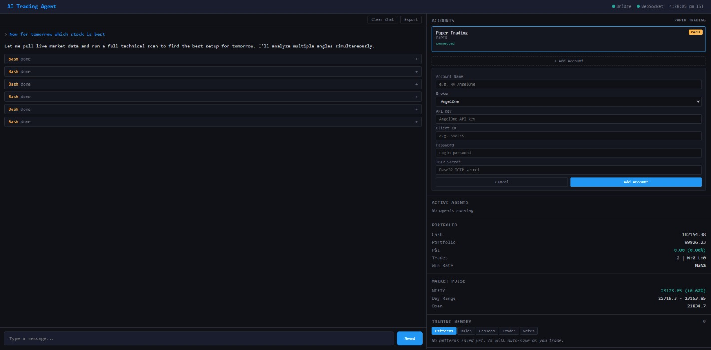

<h1 align="center">AI Trading Agent</h1>
<p align="center">
  <strong>Autonomous AI-powered trading system for Indian stock markets (NSE/BSE)</strong><br>
  Chat with an AI agent that analyzes markets, executes trades, and manages risk — all from a single dashboard.
</p>

<p align="center">
  <a href="#quick-start"></a>
  <a href="#quick-start"></a>
  <a href="#supported-brokers"></a>
  <a href="https://www.nseindia.com"></a>
  <a href="https://claude.ai/claude-code"></a>
  <a href="LICENSE"></a>
</p>

<p align="center">
  
</p>

---

> **DISCLAIMER:** This software is for **educational and research purposes only**. Not financial advice. Trading involves substantial risk of loss. Paper trading results are simulated. Always consult a SEBI-registered investment advisor. See [full disclaimer](#disclaimer).

---

## What is AI Trading Agent?

AI Trading Agent is an open-source, self-hosted trading toolkit that combines:

- **AI Chat Interface** — Talk to Claude Code in natural language: "analyze RELIANCE", "buy NIFTY PE at 23900", "show me oversold stocks"
- **Real-time Dashboard** — Dark-themed web UI with live market data, portfolio tracking, and agent monitoring
- **Autonomous Scanner** — Scans your watchlist every N minutes, scores stocks 0-10 on technical confluence
- **Paper + Live Trading** — Switch between paper trading and real broker execution with one click
- **Multi-Broker Support** — Groww, AngelOne, Zerodha, Upstox — add accounts from the dashboard
- **Background Agents** — Persistent trade monitors that track SL/target and auto-exit positions
- **Trading Memory** — AI remembers patterns, rules, lessons, and past trades across sessions
- **Skills Cache** — Common queries execute instantly without AI having to regenerate commands
- **Self-Modifying Dashboard** — Ask the AI to change the UI itself: "add a watchlist panel", "make font bigger", "add BANKNIFTY to market pulse"

```
You type → AI analyzes → Executes trade → Monitors position → Auto-exits at SL/Target
          ↓                                    ↓
    Saves to memory                  Live P&L in dashboard

"Add a sector heatmap panel" → AI edits the dashboard code → Refresh browser → Done
```

---

## Features

### AI Chat + Dashboard

| Feature | Description |
|---------|-------------|
| **Natural Language Trading** | "Buy NIFTY PE at 23900, SL 5pts, target 10pts" — AI validates, executes, monitors |
| **Real-time Streaming** | Claude Code CLI streams responses with live tool execution blocks |
| **Stop & Interrupt** | Hit Escape or type a new message to cancel current AI response instantly |
| **Chat History** | Persists across page refreshes. Export as text file anytime |
| **Multi-Account** | Manage paper + multiple real broker accounts from the dashboard |
| **Trading Memory** | AI auto-saves patterns, rules, lessons, trades, and notes |
| **Skills Cache** | First-time queries get cached — next time they execute instantly |
| **Self-Modifying UI** | Ask "add a watchlist panel" — AI edits the dashboard code live |
| **Live Portfolio P&L** | Real-time unrealized/realized P&L with live NSE prices for holdings |

### Technical Analysis

| Category | Indicators |
|----------|-----------|
| **Momentum** | RSI(14), Stochastic %K/%D, Williams %R |
| **Trend** | SMA 20/50, EMA 9, MACD(12,26,9), SuperTrend, Chandelier Exit |
| **Volatility** | Bollinger Bands(20,2), ATR(14), Annual Volatility |
| **Volume** | VWAP (20-day rolling) |
| **Levels** | Auto-detected Support & Resistance (swing high/low) |
| **Patterns** | 22 candlestick patterns with sentiment and strength |
| **Historical** | Find past setups with same RSI/BB/SMA → show 5d/10d/20d forward returns |

### Options & F&O

| Feature | Description |
|---------|-------------|
| **Greeks** | Black-Scholes: Delta, Gamma, Theta, Vega, Rho |
| **IV Calculator** | Implied Volatility from market premium |
| **Max Pain** | OI-weighted strike calculation |
| **Strategy Builder** | Bull Put Spread, Bear Call Spread, Iron Condor, Straddle, Strangle, Calendar |
| **Regime Detection** | TRENDING_UP, TRENDING_DOWN, VOLATILE, RANGE_BOUND |
| **Position Sizing** | Kelly Criterion + risk-based lot calculation |

### Autonomous Bot

| Feature | Description |
|---------|-------------|
| **Confluence Scoring** | Scores stocks 0-10 across RSI, MACD, VWAP, SuperTrend, Stochastic, BB, Support, Patterns |
| **Auto Paper Trade** | Executes virtual trades on score >= 7 with ATR-based position sizing |
| **Telegram Alerts** | Get alerts on phone + control bot via `/analyze`, `/scan`, `/buy`, `/portfolio` |
| **Trade Journal** | Win rate, profit factor, expectancy, max drawdown tracking |

---

## Quick Start

### Prerequisites

- [Node.js 22+](https://nodejs.org)
- [Python 3.12+](https://python.org) (for dashboard)
- [Claude Code CLI](https://docs.anthropic.com/en/docs/claude-code) (`npm install -g @anthropic-ai/claude-code`)

### Install

```bash
# Clone
git clone https://github.com/Manjussha/AI-trader.git
cd AI-trader

# Install Node dependencies
npm install

# Install Python dependencies (for dashboard)
pip install starlette uvicorn httpx
```

### Run the Dashboard

```bash
# Option 1: Start everything with one command
npm run agent-ui

# Option 2: Start separately
node node-bridge.mjs          # Terminal 1: Start the data bridge (port 3001)
python dashboard/run.py        # Terminal 2: Start the dashboard (port 8000)
```

Open **http://localhost:8000** — start chatting with the AI agent.

### Run the CLI

```bash
npm run cli                    # Interactive terminal REPL
npm run bot                    # Autonomous scanner + dashboard
npm run bot:paper              # Scanner + auto paper trade on strong signals
```

No API key needed for market data — NSE India public API + Yahoo Finance are used for all price data.

---

## Dashboard UI

<p align="center">
  
</p>

### Left Panel — AI Chat
- Chat with Claude Code in natural language
- See tool executions (curl calls, analysis) in collapsible blocks
- Stop button + Escape key to interrupt
- Type a new message while AI is responding — auto-cancels previous
- Chat history persists across refreshes

### Right Panel — Live Data
- **Accounts** — Switch between paper trading and real broker accounts
- **Active Agents** — Background trade monitors with live P&L
- **Portfolio** — Cash, holdings, unrealized/realized P&L with live prices
- **Market Pulse** — NIFTY live price, day range, auto-refreshes
- **Trading Memory** — Patterns, rules, lessons, trades, notes

---

## Self-Modifying Dashboard

The AI chatbot has **full access** to read and edit the dashboard code. Ask it to customize the UI:

```
> "Add BANKNIFTY to the market pulse panel"
> "Make the chat font size 14px"
> "Add a new panel showing top 5 gainers"
> "Change the accent color to green"
> "Add a keyboard shortcut for quick buy"
```

The bot uses `Read` to inspect current code, `Edit` to make surgical changes, and tells you to refresh the browser. It has access to all project files:

| Tool | What it does |
|------|-------------|
| `Read` | Read any file in the project |
| `Edit` | Modify existing files (targeted replacements) |
| `Write` | Create new files |
| `Bash` | Run shell commands, curl, node scripts |
| `Glob` | Find files by pattern |
| `Grep` | Search code content |

---

## Architecture

```
Browser (localhost:8000)
    │ WebSocket
    ▼
Python Starlette + Uvicorn          ← Dashboard server
    │ Spawns claude -p subprocess   ← Claude Code CLI (AI backend)
    │ httpx async HTTP              ← Bridge client
    ▼
Node.js Bridge (localhost:3001)     ← REST API wrapping all JS modules
    │
    ├── GrowwClient (NSE/Yahoo)     ← Free market data (no auth)
    ├── Analytics (RSI, MACD...)    ← Technical indicators
    ├── Patterns (22 candlestick)   ← Pattern recognition
    ├── Greeks (Black-Scholes)      ← Options calculator
    ├── Paper Trade Engine          ← Virtual portfolio
    ├── Trade Journal               ← Performance tracking
    ├── History Analyzer            ← Similarity matching
    ├── Broker Adapters             ← Groww/AngelOne/Zerodha/Upstox
    └── Skills + Memory             ← Persistent caches
```

**Why this architecture?**
- **Node bridge** keeps NSE connections warm (cookies, TLS keep-alive) — sub-second market data
- **Python dashboard** uses Starlette + native WebSocket for real-time streaming
- **Claude Code CLI** as AI backend — no API key needed, full tool execution capabilities
- **Skills cache** — common queries execute instantly without AI regenerating commands

---

## Confluence Scoring (0-10)

Every stock gets scored across 10 independent technical factors:

| Factor | Points | Condition |
|--------|--------|-----------|
| Daily BUY signal | +2 | RSI + MACD + SMA all agree |
| RSI < 35 | +2 | Strongly oversold |
| RSI 35-45 | +1 | Mildly oversold |
| Stochastic oversold | +1 | %K < 20 |
| SuperTrend BULLISH | +1 | Trend direction up |
| Price above VWAP | +1 | Institutional buying |
| Below Bollinger lower | +1 | Statistical extreme |
| Near support (1.5%) | +1 | Key level holding |
| Bullish candlestick | +1 | Hammer, Engulfing, Morning Star, etc. |

- **Score >= 6** — Alert fired (terminal + Telegram)
- **Score >= 7** — Auto paper trade with ATR-based sizing

---

## Supported Brokers

Manage accounts directly from the dashboard — add API credentials, test connection, switch active account with one click.

| Broker | Cost | Auth | What You Need |
|--------|------|------|---------------|
| **Paper Trading** | Free | None | Nothing — always available |
| **Groww** | Free | JWT + TOTP | API Key, TOTP Secret |
| **AngelOne** | Free | TOTP | API Key, Client ID, Password, TOTP Secret |
| **Zerodha** | Rs 2,000/mo | OAuth | API Key, API Secret, Access Token |
| **Upstox** | Free | OAuth2 | API Key, API Secret, Access Token |

> Market data (prices, indices, historical OHLCV) uses free NSE India + Yahoo Finance APIs. Broker credentials are only needed for real order execution.

<details>
<summary><b>Environment variables (alternative to dashboard UI)</b></summary>

```env
BROKER=groww        # or angelone | zerodha | upstox

# Groww
GROWW_API_KEY=
TOTP_SECRET=

# AngelOne
ANGELONE_API_KEY=
ANGELONE_CLIENT_ID=
ANGELONE_PASSWORD=
ANGELONE_TOTP_SECRET=

# Zerodha
ZERODHA_API_KEY=
ZERODHA_API_SECRET=
ZERODHA_ACCESS_TOKEN=

# Upstox
UPSTOX_API_KEY=
UPSTOX_API_SECRET=
UPSTOX_ACCESS_TOKEN=

# Telegram (optional)
TELEGRAM_BOT_TOKEN=
TELEGRAM_CHAT_ID=
```

</details>

---

## Add Your Own Broker

Extend `BaseBroker` — implement 8 methods:

```js
// src/brokers/my-broker.js
import { BaseBroker } from './base.js';

export class MyBroker extends BaseBroker {
  constructor(config) { super(config); this.name = 'MyBroker'; }

  async authenticate()       { /* return access token */ }
  async placeOrder(params)   { /* return { orderId, status } */ }
  async cancelOrder(id)      { /* cancel pending order */ }
  async getHoldings()        { /* return holdings array */ }
  async getPositions()       { /* return positions array */ }
  async getFunds()           { /* return { available, used, total } */ }
  async getOrderList()       { /* return orders array */ }
  async getOrderDetail(id)   { /* return single order */ }
}
```

Register in `src/brokers/index.js` and set `BROKER=my-broker` in `.env`.

---

## CLI Commands

```bash
npm run cli                    # Interactive REPL
npm run bot                    # Autonomous scanner
npm run bot:paper              # Auto paper trade on score >= 7
npm run bridge                 # Start Node.js data bridge
npm run agent-ui               # Start full dashboard (bridge + Python)
npm run q RELIANCE             # Quick scan single stock
npm run advisor                # Standalone AI advisor
npm run monitor                # Real-time market monitor
npm run portfolio              # Portfolio viewer
npm run stock                  # Stock detail viewer
```

### Bot Options

```bash
node trading-bot.mjs [options]

  --mode        watch | paper | live     Default: watch
  --watchlist   RELIANCE,TCS,INFY       Comma-separated NSE symbols
  --interval    5                        Minutes between scans
  --capital     100000                   Paper trading capital (INR)
  --risk        1                        % of capital to risk per trade
  --min-score   6                        Alert threshold (0-10)
  --index       "NIFTY 50"              Index to screen
```

---

## Telegram Bot

Get alerts on your phone and control the bot remotely.

**Setup:** Set `TELEGRAM_BOT_TOKEN` and `TELEGRAM_CHAT_ID` in `.env`, then run `npm run bot`.

| Command | Action |
|---------|--------|
| `/status` | Market status, NIFTY level, scan count |
| `/scan` | Scan watchlist now |
| `/scan RELIANCE,TCS` | Scan specific symbols |
| `/analyze SYMBOL` | Full technical analysis |
| `/portfolio` | Paper portfolio P&L |
| `/buy SYMBOL QTY` | Paper buy from phone |
| `/gainers` / `/losers` | Top movers |
| `/pause` / `/resume` | Control scanning |

---

## MCP Server (Claude Desktop)

Use all tools via natural language inside Claude Desktop:

```json
{
  "mcpServers": {
    "ai-trader": {
      "command": "node",
      "args": ["C:/path/to/AI-trader/src/server.js"]
    }
  }
}
```

---

## Project Structure

```
AI-trader/
├── dashboard/                    # Python web dashboard
│   ├── run.py                   # Entry point (starts bridge + uvicorn)
│   ├── app.py                   # Starlette routes + WebSocket
│   ├── claude_chat.py           # Claude Code CLI streaming engine
│   ├── agents.py                # Background agent registry
│   ├── bridge.py                # Async HTTP client to Node bridge
│   └── static/index.html        # Single-page dark-theme UI
├── node-bridge.mjs              # REST API wrapping all JS modules (port 3001)
├── trading-bot.mjs              # Autonomous scanner bot
├── cli.mjs                      # Interactive terminal REPL
├── src/
│   ├── server.js                # MCP server (30+ tools)
│   ├── groww-client.js          # NSE India + Yahoo Finance + Groww API
│   ├── analytics.js             # RSI, MACD, BB, ATR, VWAP, SuperTrend...
│   ├── patterns.js              # 22 candlestick patterns
│   ├── greeks.js                # Black-Scholes options calculator
│   ├── fo-skill.js              # F&O strategy builder + regime detection
│   ├── paper-trade.js           # Virtual trading engine
│   ├── trade-journal.js         # Performance tracker
│   ├── history-analyzer.js      # Historical similarity matching
│   ├── telegram.js              # Telegram bot (alerts + control)
│   └── brokers/
│       ├── base.js              # Abstract broker interface
│       ├── groww.js             # Groww adapter
│       ├── angelone.js          # AngelOne Smart API
│       ├── zerodha.js           # Zerodha Kite Connect
│       ├── upstox.js            # Upstox v2
│       └── index.js             # Broker factory
├── tools/                       # Utility scripts
├── dashboards/                  # Terminal-based dashboards
├── data/                        # Runtime data (gitignored)
│   ├── paper-portfolio.json     # Paper trading state
│   ├── skills.json              # AI skills cache
│   ├── trading-memory.json      # Persistent trading memory
│   └── accounts.json            # Broker account configs
├── CLAUDE.md                    # AI context file
├── package.json
└── .env                         # Credentials (gitignored)
```

---

## Security

- `.env` and `data/accounts.json` are in `.gitignore` — credentials never committed
- All API keys stay local on your machine
- Paper trading is fully isolated — zero real money
- Live mode requires explicit account activation in the dashboard
- Real broker orders require AI to double-confirm with user

---

## Tech Stack

| Layer | Technology |
|-------|-----------|
| **AI Backend** | Claude Code CLI (`claude -p` with stream-json) |
| **Dashboard** | Python Starlette + Uvicorn (ASGI, WebSocket) |
| **Data Bridge** | Node.js HTTP server (port 3001) |
| **Market Data** | NSE India public API + Yahoo Finance (free) |
| **Indicators** | Custom JS implementations (zero dependencies) |
| **Frontend** | Vanilla HTML/CSS/JS (single file, no build step) |
| **Storage** | JSON files (paper portfolio, memory, skills, accounts) |

---

## Contributing

1. Fork the repo
2. Create a feature branch (`git checkout -b feature/your-feature`)
3. Commit changes (`git commit -m "Add your feature"`)
4. Push to branch (`git push origin feature/your-feature`)
5. Open a Pull Request

---

## License

MIT — free to use, modify, and share. See [LICENSE](LICENSE).

---

## Disclaimer

This project is an **open-source educational tool**. By using this software, you agree:

1. **Not financial advice.** Nothing in this codebase constitutes financial, investment, or trading advice. All signals and trade plans are algorithm-generated for educational purposes.

2. **Risk of loss.** Trading equities, futures, and options (F&O) carries substantial risk. You may lose your entire capital. F&O losses can exceed initial investment.

3. **No liability.** Authors and contributors shall not be held liable for any financial losses arising from use of this software.

4. **Backtests are not predictions.** Historical results do not predict future performance.

5. **Regulatory compliance.** Automated trading may be subject to SEBI regulations and broker terms of service. Ensure compliance.

6. **Live trading.** Real broker mode places real orders with real money. Use only after thorough paper testing.

7. **Data accuracy.** No guarantees about accuracy or timeliness of market data.

**Always consult a SEBI-registered investment advisor before making real trading decisions.**

---

<p align="center">
  Built for Indian retail traders who want institutional-grade tools without institutional-grade cost.
  <br><br>
  <a href="#quick-start">Get Started</a> &bull; <a href="#dashboard-ui">Dashboard</a> &bull; <a href="#supported-brokers">Brokers</a> &bull; <a href="#features">Features</a>
</p>
